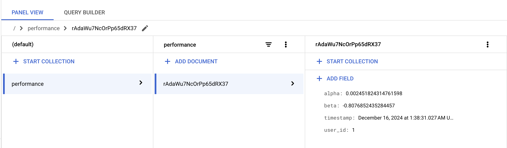
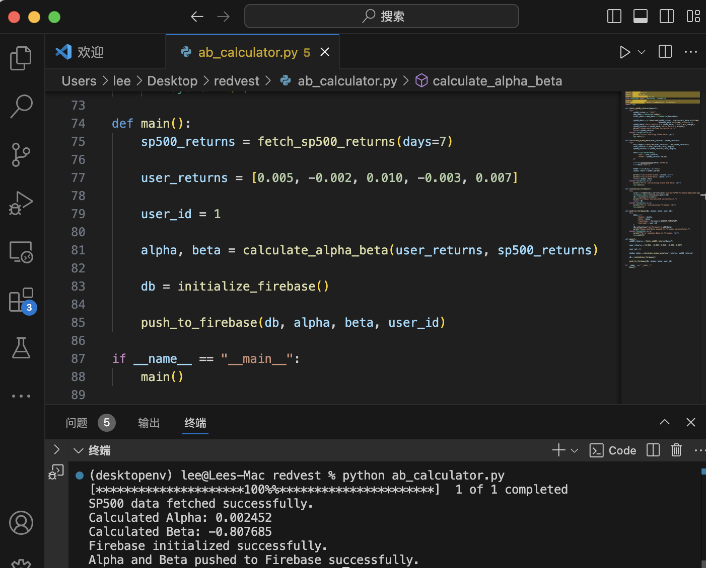

# Alpha and Beta Calculator




## Introduction

The **Alpha and Beta Calculator** is a tool designed to compute the alpha and beta coefficients of a user's investment portfolio relative to the S&P 500 (SP500) index.
## Features

- **Data Retrieval:** Fetches the latest SP500 data.
- **Statistical Analysis:** Calculates alpha and beta coefficients.
- **Firebase Integration:** Stores the calculated metrics in Firebase Firestore.

## Setup

1. **Clone the Repository**

   ```bash
   git clone https://github.com/yourusername/alpha-beta-calculator.git
   cd alpha-beta-calculator
